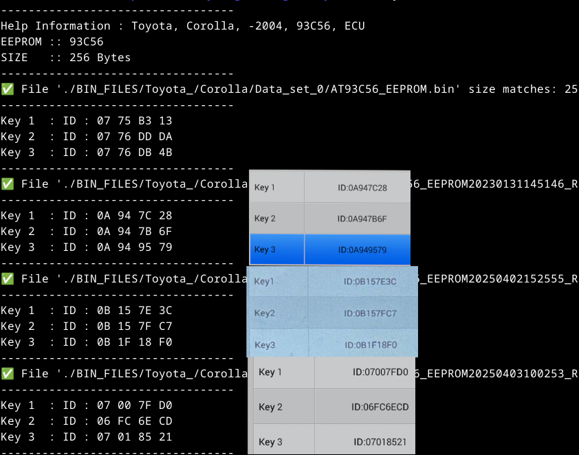

# KeyProgramming_Study


###**Toyota corolla**

```
Toyota Corolla was first launched in 1966
 
```

```
EEPROM
Memory Size	2Kbit
Memory Organization	256 x 8, 128 x 16
AT93C56
2 MHz clock frequency 
Low-voltage and standard-voltage operation 
```


**Notes:**

```
Toyota introduced the Corolla Altis in India in 2003 and offered three generations until its discontinuation in 2020 due to BS6 emission norms and declining sales. The eleventh-generation Corolla Altis, launched in April 2014, came with a 1.8-litre petrol engine producing 138.1bhp and a 1.4-litre diesel engine producing 87.2bhp. In March 2017, a facelifted version was introduced with updated features. The Corolla Altis was discontinued in March 2020


I think it sold approximately 116,000 units until its discontinuation in March 2020.

```


**AIM:**

Find the Toyota Corolla memory address of three keys.

Write the decoding program and extract the three key values from the .bin file.


**run**


```
bash Toyota_Corolla_Decode.sh 

```


**`Result :`**



