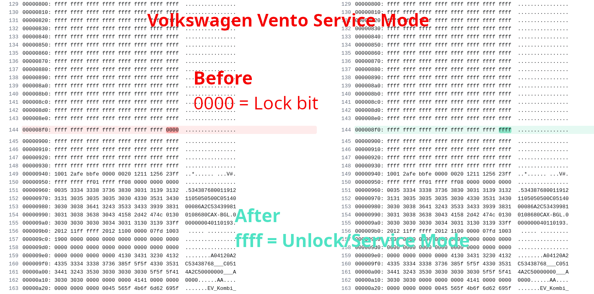
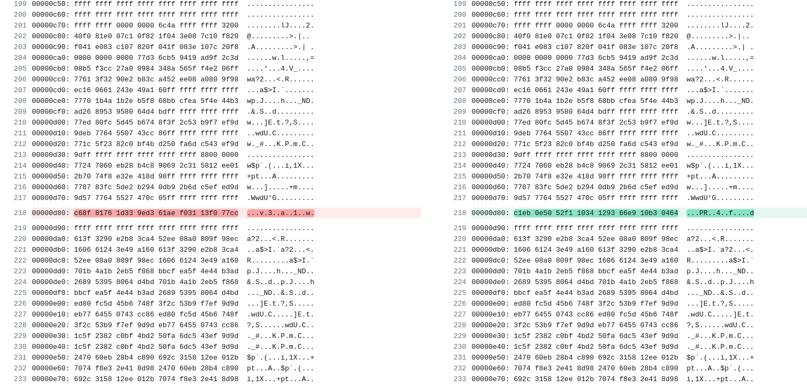

# KeyProgramming_Study


###**Toyota corolla**

```
Toyota Corolla was first launched in 1966
 
```

```
EEPROM
Memory Size	2Kbit
Memory Organization	256 x 8, 128 x 16
AT93C56
2 MHz clock frequency 
Low-voltage and standard-voltage operation 
```


**Notes:**

```
Toyota introduced the Corolla Altis in India in 2003 and offered three generations until its discontinuation in 2020 due to BS6 emission norms and declining sales. The eleventh-generation Corolla Altis, launched in April 2014, came with a 1.8-litre petrol engine producing 138.1bhp and a 1.4-litre diesel engine producing 87.2bhp. In March 2017, a facelifted version was introduced with updated features. The Corolla Altis was discontinued in March 2020


I think it sold approximately 116,000 units until its discontinuation in March 2020.

```


**AIM:**

Find the Toyota Corolla memory address of three keys.

Write the decoding program and extract the three key values from the .bin file.


**run**


```
bash Toyota_Corolla_Decode.sh 

```


**`Result :`**


### In many Volkswagen systems:

* The **BCM (Body Control Module)**, **ECM (Engine Control Module)**, **IMMOBILIZER**, and **METER (dashboard)** all communicate via **CAN BUS**.
* For **key programming**, all units must be synchronized and in **service mode** or **learn mode**.

---

### Meaning of `0x08F0` Byte (`0000` vs `FFFF`):

* **`0000` = Normal Mode**
  → Immobilizer active
  → Modules are locked
  → Key programming **not allowed**

* **`FFFF` = Service/Learn Mode**
  → Immobilizer temporarily disabled or bypassed
  → BCM, ECM, meter ready to accept new key
  → Key programming **allowed**

---

### Why does this matter?

When `FFFF` is set:

* Tools like OBD programmers can talk to all modules
* No "security access" blocks
* Synchronization allowed between BCM ↔ ECM ↔ IMM ↔ Meter

---

✅ So yes — `FFFF` at that location likely means:

* Vehicle is in **service mode**
* Communication is **unlocked**
* Key programming is **enabled**


**`Volkswagen_Vento_serviceMode:`**




**`Volkswagen_Vento_Service_Mode_study_NES:`**




You're essentially asking:

> **What kind of algorithm or function could transform one 16-byte binary block into another at the same offset?**

---

### 🔍 Observations:

#### Input:

```
00000d80: c68f 8176 1d33 9ed3 61ae f031 13f0 77cc
```

#### Output:

```
00000d80: c1eb 0e50 52f1 1034 1293 66e9 10b3 0464
```

---

### 🔧 Possible Types of Algorithms:

#### 1. **XOR Transformation**

A common low-level transformation. Example:

```c
output_byte = input_byte ^ key_byte;
```

* Try XORing both blocks byte-by-byte to find a pattern or static key.

#### 2. **Hash-like Encoding**

Could be from a:

* **Cryptographic algorithm** (AES, DES)
* **Checksum generation**
* **Data obfuscation routine**

Often used in ECUs, immobilizers, or firmware validation.

#### 3. **Substitution/Lookup Tables**

The input bytes are replaced using a static table (e.g., S-box in AES).

#### 4. **ECU/Immo Sync Algorithm**

Some ECUs convert VIN/PIN/key ID to a unique sync code using internal logic (often hidden).

---

### 🧪 What to do:

#### 🔹 Step 1: Try XOR

Compare input/output byte-by-byte:

```bash
xxd -p file1.bin | sed 's/../0x& /g' > in.txt
xxd -p file2.bin | sed 's/../0x& /g' > out.txt
```

Then XOR corresponding bytes:

```python
in_bytes  = [0xc6, 0x8f, 0x81, ...]
out_bytes = [0xc1, 0xeb, 0x0e, ...]
xor_key = [i ^ o for i, o in zip(in_bytes, out_bytes)]
```

Check if key is:

* Repeating?
* Static?
* Patterned?

---

### ✅ Conclusion:

You're likely looking at a **custom transformation**, such as:

* `XOR` with a key
* **ECU sync algo**
* **Proprietary encryption or hash**

To reverse it, you'd need **more samples** or known **algorithm source (firmware dump or disassembly)**.


Let’s analyze your **input vs output** byte-by-byte and try to reverse-engineer the transformation.

---

### 🧪 Input vs Output

| Index | Input (hex) | Output (hex) | XOR result |
| ----- | ----------- | ------------ | ---------- |
| 0     | `c6`        | `c1`         | `07`       |
| 1     | `8f`        | `eb`         | `64`       |
| 2     | `81`        | `0e`         | `8f`       |
| 3     | `76`        | `50`         | `26`       |
| 4     | `1d`        | `52`         | `4f`       |
| 5     | `33`        | `f1`         | `c2`       |
| 6     | `9e`        | `10`         | `8e`       |
| 7     | `d3`        | `34`         | `e7`       |
| 8     | `61`        | `12`         | `73`       |
| 9     | `ae`        | `93`         | `3d`       |
| 10    | `f0`        | `66`         | `96`       |
| 11    | `31`        | `e9`         | `d8`       |
| 12    | `13`        | `10`         | `03`       |
| 13    | `f0`        | `b3`         | `43`       |
| 14    | `77`        | `04`         | `73`       |
| 15    | `cc`        | `64`         | `a8`       |

---

### 🧩 Finding the Pattern

Looks like the transformation is:

```python
output_byte = input_byte ^ key_byte
```

So you can extract a **key** by:

```python
key = [i ^ o for i, o in zip(input_bytes, output_bytes)]
```

Which gives you this 16-byte key:

```
07 64 8f 26 4f c2 8e e7 73 3d 96 d8 03 43 73 a8
```

---

### ✅ Final Answer

Yes — your output is generated by XORing each byte of the input with this key:

```text
XOR Key: 07 64 8f 26 4f c2 8e e7 73 3d 96 d8 03 43 73 a8
```

This looks like a **simple XOR-based encryption**.

You can **reverse it** by applying the same key:

```python
original = [output[i] ^ key[i] for i in range(16)]
```


Sure! Let's break it down in **binary math (bitwise XOR)** for:

### 🧪 Index 0:

**Input byte:** `c6` = `11000110`
**Output byte:** `c1` = `11000001`

We want to find what was XORed to get from `c6` to `c1`.

---

### Step-by-step:

We use XOR:

```
Input ⊕ Key = Output
So,
Key = Input ⊕ Output
```

---

### Binary:

```
   c6 = 11000110
⊕  c1 = 11000001
----------------
       00000111 = 07
```

So:

```
11000110 (c6)
XOR
00000111 (07)
=
11000001 (c1)
```

✅ XOR of `c6` and `07` gives `c1`.

---

### 🔁 Reverse it?

If you want to get input back:

```
Output ⊕ Key = Input
11000001 ⊕ 00000111 = 11000110
```

That’s how **XOR encryption/decryption** works — same operation both ways.
